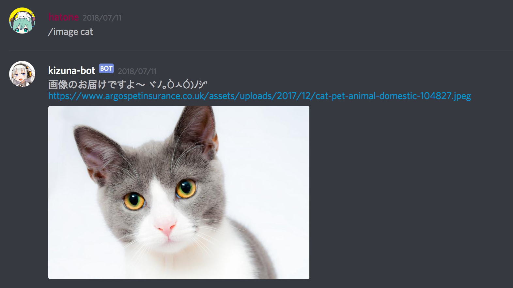

# Discord bot for Heroku

**[Heroku](https://jp.heroku.com)** で **[Discord](https://discordapp.com) bot** を動かしたい場合のサンプルです。

[こちらのブログ記事](http://nekonenene.hatenablog.com/entry/2018/07/19/061201) で Discord bot の作り方を説明した際の資料のひとつです。

<p align="center">
    
</p>


## 1. .env の編集

`.env` ファイルの **BOT_CLIENT_ID** および **BOT_TOKEN** の値を適切なものに変更します。  
少なくともそれらの値を設定しないと動きません。

なお、他の API Key の取得場所について記しておきます。

* RSS2JSON_API_KEY : https://rss2json.com
* RECRUIT_API_KEY : https://webservice.recruit.co.jp/register/index.html
* CUSTOM_SEARCH_ENGINE_ID, CUSTOM_SEARCH_API_KEY : https://developers.google.com/custom-search/json-api/v1/overview


## 2. Heroku へのアップロード

heroku CLI を PC にインストールし、

```sh
heroku login
heroku git:remote -a your-project-name
git push heroku master
```

でコードをアップロードします。

ここは Heroku のプロジェクトページで案内が表示されますし、  
参考になる記事も多いですので「Heroku 使い方」なんかでググるとよいかと。


## 3. bot process の有効化

`Procfile` ファイルで bot プロセスを宣言していますが、  
Heroku はデフォルトでは web プロセスしか有効化されませんので、明示的に有効にしてあげます。

```sh
heroku ps:scale bot=1
```

と打ちます。


## 4. ログの確認

アップロードして「Build succeeded」と表示されても、 3. の有効化をおこなっても、まだ実行は開始していません。  
特に最初の実行開始までは時間かかります。（私は1時間以上かかりました）

まだかな〜と不安に思ったらログをチェックしましょう。  
「思ったとおりに機能が動かないな……」と感じた際にもログのチェックは有効です。

```sh
heroku logs
```

```
2018-07-18T10:21:35.466183+00:00 heroku[bot.1]: Starting process with command `bundle exec ruby kizuna_bot.rb`
2018-07-18T10:21:36.225099+00:00 heroku[bot.1]: State changed from starting to up
```

というような表示がされて初めて起動が開始しています。

なお、「ログ長い、直近の10行だけでいい」と思う場合は

```sh
heroku logs -n 10
```

などと入力してください。


## 5. その他

### 5-1. タイムゾーンの指定

今回の bot はあまり関係しませんが、タイムゾーンを日本時刻に設定しておくと何かと便利かもしれません。  
そうしたい場合は、

```sh
heroku config:add TZ=Asia/Tokyo
```

と打ちます。

### 5-2. dotenv を使わない場合

事情があって dotenv を使いたくない場合は、  
kizuna_bot.rb の `Dotenv.load` をコメントアウトし、環境変数を Heroku に直接渡してあげます。

```sh
heroku config:set BOT_CLIENT_ID="aaa" BOT_TOKEN="bbb"
```

というようなコマンドで、 Heroku への環境変数の設定が可能です。

なお、設定されている環境変数の一覧は

```sh
heroku config
```

で確認することができます。
